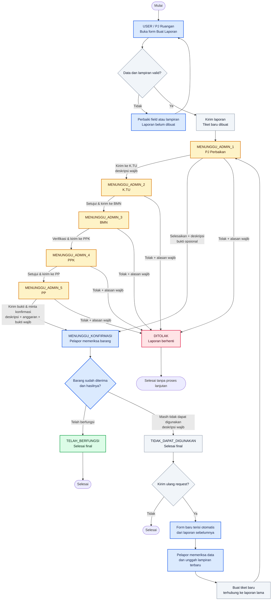
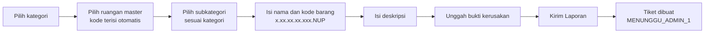
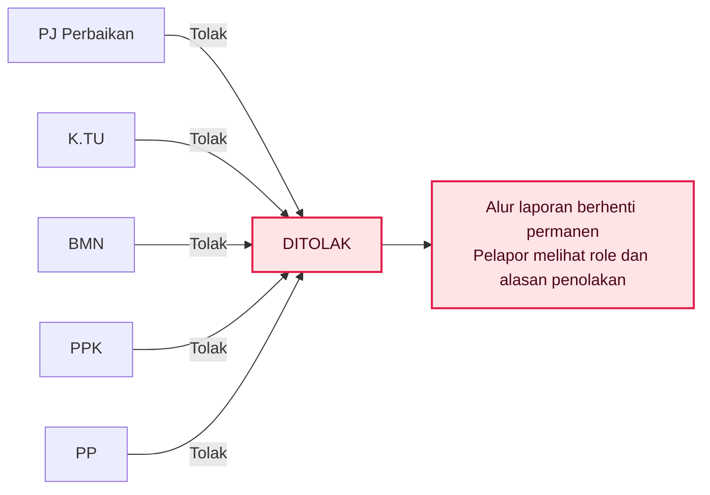
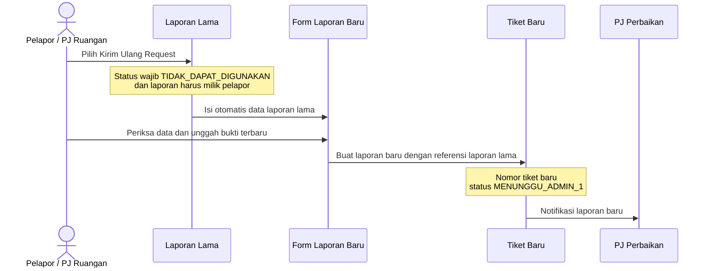

# Workflow Laporan Perbaikan Barang & Alat

Dokumen ini menggambarkan alur yang saat ini benar-benar dijalankan aplikasi,
mulai dari pelapor membuat laporan sampai laporan selesai, ditolak, atau dikirim
ulang. Terakhir diverifikasi terhadap implementasi pada **1 Oktober 2026**.

## Diagram workflow lengkap

### Cara membaca diagram

- **Biru**: tindakan pelapor/PJ Ruangan.
- **Kuning**: laporan sedang menunggu role operasional tertentu.
- **Hijau**: laporan selesai dan barang dikonfirmasi berfungsi.
- **Merah**: laporan ditolak dan alurnya berhenti.
- **Abu-abu**: validasi, pencatatan sistem, atau status akhir alternatif.

## Urutan role dan keputusan

| Tahap | Role aplikasi | Nama di UI | Aksi lanjut | Aksi selesai | Aksi tolak |
|---|---|---|---|---|---|
| Pelapor | `USER` | PJ Ruangan | Membuat, melihat, dan mengonfirmasi laporan | Konfirmasi barang berfungsi/tidak berfungsi | Tidak ada |
| 1 | `ADMIN_1` | PJ Perbaikan | Kirim ke K.TU | Bisa langsung minta konfirmasi pelapor | Bisa menolak |
| 2 | `ADMIN_2` | K.TU | Setujui dan kirim ke BMN | Tidak ada | Bisa menolak |
| 3 | `ADMIN_3` | BMN | Verifikasi dan kirim ke PPK | Tidak ada | Bisa menolak |
| 4 | `ADMIN_4` | PPK | Setujui dan kirim ke PP | Tidak ada | Bisa menolak |
| 5 | `ADMIN_5` | PP | Tidak memiliki tombol lanjut biasa | Kirim bukti dan minta konfirmasi pelapor | Bisa menolak |
| Pemantau | `SUPER_ADMIN` | Admin Utama | Hanya memantau | Tidak ada | Tidak ada |
| Pemantau | `EXECUTIVE` | Kepala Balai | Hanya membaca/statistik | Tidak ada | Tidak ada |

> PJ Perbaikan (`ADMIN_1`) dan PPK (`ADMIN_4`) dibatasi kategori tugasnya.
> Mereka hanya dapat mengambil keputusan untuk laporan dengan kategori yang
> sesuai scope akun. K.TU, BMN, dan PP tidak memakai pembatas kategori ini.

## 1. Pelapor membuat laporan

Data penting yang divalidasi sebelum tiket dibuat:

- jenis/kategori perbaikan;
- nama pelapor;
- nama ruangan dari master data dan kode ruangan yang terhubung dengannya;
- nama barang;
- subkategori yang memang berada di bawah kategori terpilih;
- kode barang dengan format `x.xx.xx.xx.xxx.<NUP>`, dengan NUP 1–3 digit;
- deskripsi kerusakan, maksimal 2.000 karakter;
- minimal satu lampiran JPG, PNG, WEBP, atau PDF;
- maksimal 10 lampiran dan maksimal 2 MB per file.

Sistem memakai kunci idempotensi ketika mengirim laporan. Double-click atau
pengiriman ulang request jaringan dengan kunci yang sama tidak boleh membuat
dua laporan identik.

Selama status masih `MENUNGGU_ADMIN_1` dan belum diproses PJ Perbaikan,
pelapor masih dapat:

- mengedit isi laporan;
- mengganti lampiran; atau
- menghapus laporan.

Setelah laporan bergerak ke tahap berikutnya, edit dan hapus oleh pelapor
dikunci.

## 2. Semua route keputusan admin

### Route A — PJ Perbaikan meneruskan alur penuh

`MENUNGGU_ADMIN_1 → MENUNGGU_ADMIN_2`

- Tombol: **Kirim ke K.TU**.
- Deskripsi/catatan wajib diisi.
- K.TU menerima notifikasi untuk menindaklanjuti.

### Route B — PJ Perbaikan menyelesaikan langsung

`MENUNGGU_ADMIN_1 → MENUNGGU_KONFIRMASI`

- Tombol: **Selesaikan & Minta Konfirmasi Pelapor**.
- Deskripsi penyelesaian wajib.
- Bukti penyelesaian boleh dilampirkan, tetapi tidak wajib untuk PJ.
- Tahap K.TU, BMN, PPK, dan PP dilewati.
- Pelapor menerima notifikasi untuk memeriksa barang.

### Route C — K.TU menyetujui

`MENUNGGU_ADMIN_2 → MENUNGGU_ADMIN_3`

- Tombol: **Setujui & Kirim ke BMN**.
- Catatan bersifat opsional. Jika dikosongkan, UI meminta konfirmasi sebelum
  melanjutkan tanpa deskripsi.
- BMN menerima notifikasi.

### Route D — BMN menyetujui

`MENUNGGU_ADMIN_3 → MENUNGGU_ADMIN_4`

- Tombol: **Verifikasi & Kirim ke PPK**.
- Catatan bersifat opsional dengan konfirmasi UI jika dikosongkan.
- PPK menerima notifikasi.

### Route E — PPK menyetujui

`MENUNGGU_ADMIN_4 → MENUNGGU_ADMIN_5`

- Tombol: **Setujui & Kirim ke PP**.
- Catatan bersifat opsional dengan konfirmasi UI jika dikosongkan.
- PP menerima notifikasi.

### Route F — PP menyelesaikan pekerjaan

`MENUNGGU_ADMIN_5 → MENUNGGU_KONFIRMASI`

- Tombol: **Kirim Bukti & Minta Konfirmasi Pelapor**.
- Deskripsi penyelesaian wajib.
- Anggaran/biaya perbaikan wajib dan nilainya harus lebih dari nol.
- Minimal satu bukti penyelesaian JPG, PNG, WEBP, atau PDF wajib diunggah.
- Pelapor menerima notifikasi untuk memeriksa barang.
- PP tidak mempunyai route **ACC/lanjut** lain; tahap PP harus berakhir dengan
  **selesai** atau **tolak**.

### Route G — Penolakan di tahap mana pun

Aturan penolakan:

- hanya role yang sedang mendapat giliran yang bisa menolak;
- alasan penolakan wajib diisi;
- status langsung menjadi `DITOLAK`;
- pelapor menerima notifikasi;
- laporan yang ditolak tidak mempunyai tombol kirim ulang terhubung;
- jika masih diperlukan, pelapor dapat membuat laporan baru secara manual.

## 3. Konfirmasi akhir oleh pelapor

Konfirmasi hanya dapat dilakukan oleh pemilik laporan ketika statusnya
`MENUNGGU_KONFIRMASI`. Pelapor wajib mencentang bahwa barang sudah diterima,
kemudian memilih salah satu hasil berikut.

### Barang telah berfungsi

`MENUNGGU_KONFIRMASI → TELAH_BERFUNGSI`

- Menjadi status akhir sukses.
- PJ Perbaikan menerima notifikasi hasil konfirmasi.
- Tidak ada keputusan admin berikutnya.

### Barang masih tidak dapat digunakan

`MENUNGGU_KONFIRMASI → TIDAK_DAPAT_DIGUNAKAN`

- Pelapor wajib menjelaskan kondisi yang masih bermasalah.
- Menjadi status akhir untuk tiket tersebut.
- PJ Perbaikan menerima notifikasi.
- UI menampilkan tombol **Kirim Ulang Request**.

## 4. Kirim ulang request

Yang terisi otomatis:

- kategori;
- nama pelapor;
- nama dan kode ruangan;
- nama dan kode barang/NUP;
- subkategori; dan
- deskripsi lama.

Pelapor tetap harus memeriksa kembali data dan mengunggah lampiran terbaru.
Laporan baru memiliki tiket dan riwayat workflow sendiri, tetapi menyimpan
referensi ke laporan lama melalui `resubmittedFromId`.

## 5. Status dan sifatnya

| Status internal | Tampilan | Sifat |
|---|---|---|
| `MENUNGGU_ADMIN_1` | Menunggu PJ Perbaikan | Aktif; masih dapat diedit/dihapus pelapor |
| `MENUNGGU_ADMIN_2` | Menunggu K.TU | Aktif |
| `MENUNGGU_ADMIN_3` | Menunggu BMN | Aktif |
| `MENUNGGU_ADMIN_4` | Menunggu PPK | Aktif |
| `MENUNGGU_ADMIN_5` | Menunggu PP | Aktif |
| `MENUNGGU_KONFIRMASI` | Menunggu Konfirmasi Pelapor | Aktif; keputusan admin dikunci |
| `TELAH_BERFUNGSI` | Telah Berfungsi | Final sukses |
| `TIDAK_DAPAT_DIGUNAKAN` | Tidak Dapat Digunakan | Final; dapat menjadi sumber kirim ulang |
| `DITOLAK` | Ditolak | Final; alur berhenti |
| `DISETUJUI_FINAL` | Disetujui Final | Status kompatibilitas data lama; tidak dibuat oleh workflow baru |

`DISETUJUI_FINAL` masih dikenali untuk kompatibilitas data lama. Workflow baru
mengirim laporan yang diselesaikan PJ atau PP langsung ke
`MENUNGGU_KONFIRMASI`, bukan ke `DISETUJUI_FINAL`.

## 6. Route API yang menjalankan workflow

| Method dan endpoint | Pemakai | Fungsi |
|---|---|---|
| `POST /api/reports` | USER | Membuat tiket baru atau tiket kirim ulang |
| `GET /api/reports` | USER/Admin | Memuat daftar laporan sesuai akses dan filter |
| `GET /api/reports/admin` | Role admin/pemantau | Memuat antrean admin, ringkasan, dan filter workflow |
| `GET /api/reports/:id` | User yang berhak | Memuat detail satu laporan, termasuk dari notifikasi |
| `PATCH /api/reports/:id` | Pemilik laporan | Mengedit sebelum PJ Perbaikan memproses |
| `DELETE /api/reports/:id` | Pemilik laporan | Menghapus sebelum PJ Perbaikan memproses |
| `POST /api/reports/:id/decide` | ADMIN_1–ADMIN_5 sesuai giliran | Meneruskan, menyelesaikan, atau menolak |
| `POST /api/reports/:id/confirm` | Pemilik laporan | Menetapkan hasil akhir setelah barang diterima |
| `GET /api/reports/:id/attachments/:attachmentId/download` | User yang berhak | Melihat atau mengunduh lampiran terlindungi |

## 7. Aturan lintas workflow

- Keputusan hanya dapat diberikan oleh role yang sedang mendapat giliran.
- Admin Utama dan Kepala Balai bersifat read-only untuk keputusan laporan.
- Perubahan status memakai pengecekan status lama; dua keputusan bersamaan
  tidak boleh menghasilkan dua transisi. Request kedua mendapat konflik `409`.
- Semua keputusan admin dicatat dalam riwayat persetujuan dan audit log.
- Identitas/nama role pengunggah tersimpan pada metadata lampiran.
- Setelah laporan final, endpoint keputusan admin tidak menerima tindakan baru.
- Laporan dan lampiran hanya bisa diakses oleh user yang memiliki hak terhadap
  laporan tersebut.

## 8. Referensi implementasi

Dokumen ini disusun dari sumber implementasi berikut agar dapat diperbarui jika
workflow aplikasi berubah:

- [`src/lib/workflow.ts`](../src/lib/workflow.ts) — urutan status dan role yang
  mendapat giliran;
- [`src/lib/roles.ts`](../src/lib/roles.ts) — nama role, aksi yang tersedia, dan
  kewajiban deskripsi;
- [`app/api/reports/route.ts`](../app/api/reports/route.ts) — pembuatan laporan
  baru dan kirim ulang;
- [`app/api/reports/[id]/decide/route.ts`](../app/api/reports/%5Bid%5D/decide/route.ts)
  — ACC, selesai, dan penolakan admin;
- [`app/api/reports/[id]/confirm/route.ts`](../app/api/reports/%5Bid%5D/confirm/route.ts)
  — konfirmasi akhir pelapor; dan
- [`src/components/dashboard/StatusCard.tsx`](../src/components/dashboard/StatusCard.tsx)
  — UI konfirmasi serta tombol kirim ulang.

